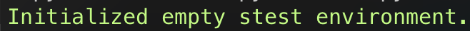
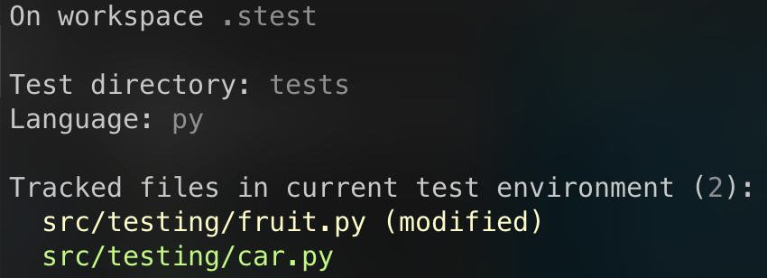
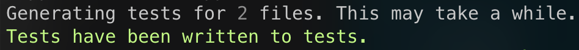
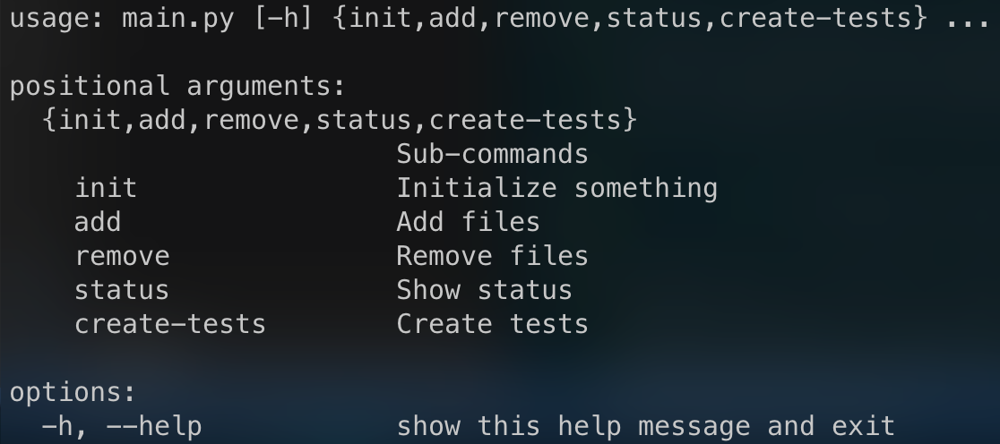
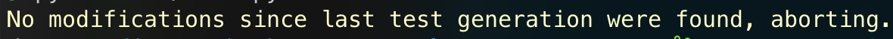
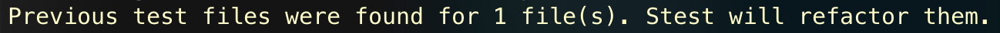

# Stest

Stest (**Smart Test**) is a compreensive command line tool that automatically generates unit tests for your code using artificial intelligence.

## Demo


## Installation

```bash
# Clone the repo
git clone git@github.com:xgeeks-geekathon/team-Hackstreet-Boys.git
cd team-Hackstreet-Boys

sudo ./build.sh  # Linux and MacOS
# or
./build.bat # Windows (admin privileges required)
```

The compiled binaries will be located in the `dist` directory.

## Usage

#### Init a new __stest__ testing environment.

```bash
stest init [path] -o [tests_dir] --language [language] # Inits a new stest testing environment
```

##### Supported languages:
- Python (`py`)
- JavaScript (`js`)
- C (`c`)
- C++ (`cpp`)

##### Output:



---

#### Add files to the testing environment.

```bash
stest add [file1] [file2] # Adds files to the testing environment
stest add . # Adds all files in the current directory to the testing environment
```

#### Remove files from the testing environment.

```bash
stest remove [file1] [file2] # Removes files from the testing environment
stest remove . # Removes all files in the current directory from the testing environment
```

---

#### List the currently tracked files.

```bash
stest status # Lists info on the currently tracked files
```

##### Output:



---

#### Create tests for the currently tracked files.

```bash
stest create-tests # Creates tests for the currently tracked files
```
##### Output:



---

## Example

#### Create a new Python project

```bash
mkdir my_project
cd my_project
touch main.py
touch car.py
```

#### Add some code to the files

```python
# main.py
from car import Car

def main():
   car = Car()
   car.drive()

if __name__ == '__main__':
   main()
```


```python
# car.py
class Car:
   def __init__(self):
      self.speed = 0

   def drive(self):
      self.speed = 100
```

#### Init a new stest testing environment

```bash
stest init . -o tests --language py
```

#### Add the files to the testing environment

```bash
stest add car.py
```

#### Create tests for the currently tracked files

```bash
stest create-tests
```

The tests will be written to the `tests`  directory specified using the `-o` flag when initializing the testing environment.

```python
# tests/test_car.py
import unittest
from car import Car

class TestCar(unittest.TestCase):
   def test_drive(self):
      car = Car()
      car.drive()
      self.assertEqual(car.speed, 100)

if __name__ == '__main__':
      unittest.main()
```

## Important Features

**Stest is not a simple command line tool.** It is a complete testing environment that allows you to create and manage your tests using a simple command line interface.

### Complete CLI

**Stest** provides a complete set of commands that allow you to manage your testing environment.



### Context awareness

**Stest** is context aware and optimized to perform the best it can in the given context as well as to minimize the number of API requests made.

**Stest** automatically detects when the files that are being tracked in the testing environment have changed and only creates tests for the files that have been modified.



Additionally, **stest** also detects when you are trying to generate tests for a file that has already been tested and tries it's best to preserve the past test logic and flow.

> This is needed because GPT-4 may generate completely different tests for the same file since the output is not deterministic.



### Config file

**Stest** uses a `json` config file to store information about the testing environment. This allows you to easily share your testing environment with other people as well as modifying it manually if needed.

```json
{
    "tracked_files": {
        "/Users/joaoamatos/coding/geekathon/team-Hackstreet-Boys/src/stest/utils.py": {
            "hash": "783e753aabd5821bf4f4b4b55b3de5b90c0add0c8ddc8f7a849a38f5aec88114"
        }
    },
    "language": "py",
    "test_framework": "pytest",
    "test_dir": "/Users/joaoamatos/coding/geekathon/team-Hackstreet-Boys/tests"
}
```

### Environment detection inside workspace subdirectories

**Stest** automatically detects when you are inside a subdirectory of the testing environment and automatically sets the testing environment to the root directory of the project by fetching the parent directories up to `MAX_PARENT_SEARCH_DEPTH`.

This allows you to call `stest` from anywhere inside the project and still have it work as expected, just like you would with `git`.

## What's next?

Given the time constraints of the geekathon, we were only able to implement the core functionality of stest. However, we plan to continue working on this project and add support for more languages and testing frameworks, as well as other features.

Here are the stuff we will be working on in the future:

- [ ] Add support for more languages
- [ ] Add support for more testing frameworks
- [ ] Add test execution and output analysis
- [ ] Add test coverage analysis
- [ ] Add GUI support

## License

**Stest** is licensed under the [MIT License](LICENSE.md).

## Authors

- https://www.github.com/joaoajmatos
- https://www.github.com/joaooliveira1201
- https://www.github.com/freaktsg